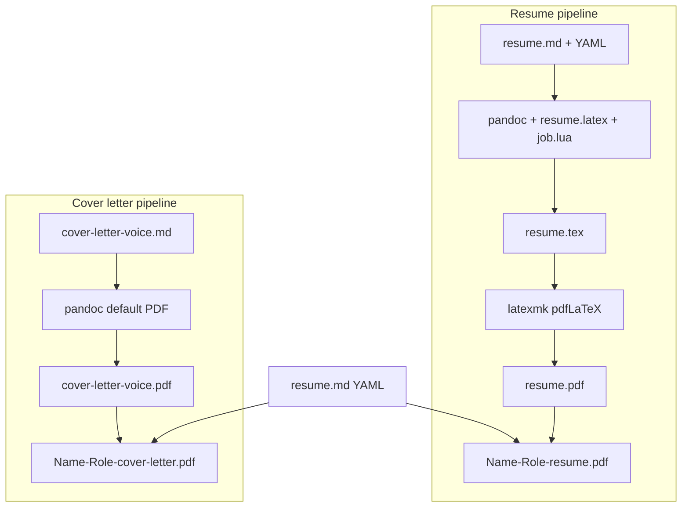

# Build process

Technical reference for compiling role artefacts to PDF. User-facing quick starts live in [README.md](README.md); architecture and design rationale in [DESIGN.md](DESIGN.md).

Both pipelines read from `roles/<company-slug>/<role-slug>/` and write outputs into the same folder. Scripts live under `template/` and are invoked from the repository root.

## Overview

| Pipeline | Entry script | Build input | Engine | Submission PDF |
|----------|--------------|-------------|--------|----------------|
| **Resume (CV)** | `scripts/build.sh` | `resume.md` | pandoc → LaTeX → `latexmk` | `{Name}-{Role}-resume.pdf` |
| **Cover letter** | `scripts/cover-letter-build.sh` | `cover-letter-<voice>.md` | pandoc (direct PDF) | `{Name}-{Role}-cover-letter.pdf` |

Each pipeline produces two PDFs per build:

1. **Build artefact** — fixed local name (`resume.pdf` or `cover-letter-<voice>.pdf`) used by the toolchain.
2. **Submission copy** — human-readable filename derived from YAML in sibling `resume.md` via `scripts/output-name.sh`.

Generated PDFs and LaTeX intermediates are [gitignored](.gitignore) by default.



## Prerequisites

**macOS** (paths assume Homebrew + BasicTeX):

```bash
brew install --cask basictex
brew install pandoc
export PATH="/Library/TeX/texbin:$PATH"   # add to ~/.zshrc
./scripts/setup.sh                        # once per machine
```

| Tool | Resume | Cover letter |
|------|--------|--------------|
| `pandoc` | required | required |
| `latexmk` | required | not used |
| BasicTeX + packages via `setup.sh` | required | not used |

`setup.sh` installs `latexmk`, `biber`, `lato`, `fontawesome`, and related collections via `tlmgr`. Cover-letter builds need only `pandoc`.

## Role folder contract

```
roles/<company-slug>/<role-slug>/
  resume.md                    # required for either pipeline (YAML source for naming)
  cover-letter-<voice>.md      # cover-letter build input only
```

**Resume build** requires `resume.md`.

**Cover-letter build** requires both `resume.md` (for submission naming) and `cover-letter-<voice>.md` where `<voice>` is `professional`, `conversational`, or `bold`.

Authoring and agent workflows (`/resume`, `/cover-letter`) are documented in [`.agents/skills/resume/SKILL.md`](.agents/skills/resume/SKILL.md) and [`.agents/skills/cover-letter/SKILL.md`](.agents/skills/cover-letter/SKILL.md). This document covers compilation only.

---

## Resume pipeline

### Command

```bash
./scripts/build.sh roles/<company-slug>/<role-slug>
./scripts/build.sh roles/<company-slug>/<role-slug> --clean   # remove artefacts only
```

### End-to-end steps

`scripts/build.sh` runs the following in the role directory:

1. **Validate** — exit if `resume.md` is missing.
2. **Environment** — set `PATH` to include `/Library/TeX/texbin`; prepend `template/` to `TEXINPUTS` so `\documentclass{altacv}` resolves to `render/altacv.cls`.
3. **Pandoc (markdown → LaTeX)** — emit `resume.tex` in the role folder:

   ```bash
   pandoc resume.md \
     -o resume.tex \
     --template="$TEMPLATE_DIR/resume.latex" \
     --lua-filter="$TEMPLATE_DIR/job.lua" \
     --from markdown+yaml_metadata_block+raw_attribute \
     --standalone \
     --shift-heading-level-by=-1
   ```

   - **`resume.latex`** — AltaCV wrapper: IFBlue palette, Lato, maps headings to `\cvsection` / `\cvsubsection`, YAML → `\makecvheader`.
   - **`job.lua`** — converts Experience job lines (`**Org — Title** · *dates | location*`) to AltaCV `\cvevent` blocks. See [DESIGN.md](DESIGN.md) for the full grammar.
   - PDF is **not** produced by pandoc's `--pdf-engine`; only `.tex` is generated here.

4. **Stale-state guard** — if a previous `latexmk` run left aux files but no `resume.pdf`, run `latexmk -C` before continuing.
5. **LaTeX compile** — `latexmk -pdf -interaction=nonstopmode -file-line-error resume.tex` → `resume.pdf`. May invoke `biber` once via the AltaCV class.
6. **Submission copy** — call `output-name.sh`, remove any existing `*-resume.pdf` in the role folder, copy `resume.pdf` to the named submission file.

### Outputs

| File | Purpose |
|------|---------|
| `resume.tex` | Generated LaTeX (gitignored) |
| `resume.pdf` | LaTeX build artefact; fixed name for `latexmk` |
| `{Name-Slug}-{Role-Label}-resume.pdf` | Submission copy |

LaTeX auxiliary files (`.aux`, `.log`, `.bcf`, etc.) are also written and gitignored.

### Clean

`--clean` removes LaTeX artefacts and `*-resume.pdf` from the role folder without rebuilding. Use when PDF content disagrees with `resume.md`:

```bash
./scripts/build.sh roles/<company-slug>/<role-slug> --clean
./scripts/build.sh roles/<company-slug>/<role-slug>
```

---

## Cover letter pipeline

### Command

```bash
./scripts/cover-letter-build.sh roles/<company-slug>/<role-slug> <voice>
```

`<voice>` selects the source markdown: `professional`, `conversational`, or `bold`.

Example:

```bash
./scripts/cover-letter-build.sh roles/ing/senior-ai-engineer-agentic-ai professional
```

### End-to-end steps

`scripts/cover-letter-build.sh` runs the following in the role directory:

1. **Validate voice** — must be `professional`, `conversational`, or `bold`.
2. **Validate inputs** — `cover-letter-<voice>.md` and `resume.md` must exist.
3. **Load metadata** — read `name`, `email`, `phone`, `location`, optional `linkedin` from `resume.md` YAML via `template/yaml-fields.sh`. Resolve date: `generated:` HTML comment in letter md → UK long form (`16 June 2026`), else build date.
4. **Pandoc (markdown → PDF)** — styled template, not AltaCV:

   ```bash
   pandoc cover-letter-<voice>.md \
     -o cover-letter-<voice>.pdf \
     --template=render/cover-letter.latex \
     --pdf-engine=pdflatex \
     -V name=… -V email=… -V phone=… -V location=… -V letter_date=… \
     [--standalone]
   ```

   Template: Lato 11pt, 1 inch margins, IFBlue name, `\pagestyle{empty}` (no page numbers). Header and date render before letter body. See [`.agents/skills/cover-letter/references/pdf-layout.md`](.agents/skills/cover-letter/references/pdf-layout.md).

5. **Submission copy** — call `output-name.sh --cover-letter`, remove any existing `*-cover-letter*.pdf` in the role folder, copy the voice artefact to the named submission file.

The voice appears in the **source markdown** and **build artefact** filenames only. The submission copy is always `{Name-Slug}-{Role-Label}-cover-letter.pdf` regardless of which variant was built.

### Outputs

| File | Purpose |
|------|---------|
| `cover-letter-<voice>.pdf` | Pandoc artefact (which variant was compiled) |
| `{Name-Slug}-{Role-Label}-cover-letter.pdf` | Submission copy (no voice in name) |

Building a different voice overwrites the submission copy. Only one `{Name}-{Role}-cover-letter.pdf` exists at a time.

### No clean target

There is no `--clean` flag. Re-run the build script after editing markdown. Pandoc overwrites `cover-letter-<voice>.pdf` in place.

---

## Submission naming (`output-name.sh`)

Both pipelines derive submission filenames from YAML in the role's `resume.md`:

```bash
./scripts/output-name.sh roles/<company-slug>/<role-slug>              # resume
./scripts/output-name.sh roles/<company-slug>/<role-slug> --cover-letter
```

### YAML fields

| Field | Required | Role |
|-------|----------|------|
| `name` | yes | `{Name-Slug}` — spaces → hyphens, non-alphanumeric stripped |
| `output_role` | no | Preferred role label for filename |
| `tagline` | no | Fallback role label |
| *(directory slug)* | — | Final fallback if neither `output_role` nor `tagline` is set |

**Role label resolution:** `output_role` → `tagline` → basename of role directory.

**Company slug is never included** in submission filenames.

### Examples

YAML:

```yaml
name: Alex Chen
tagline: Senior Software Engineer
```

Outputs:

- Resume: `Alex-Chen-Senior-Software-Engineer-resume.pdf`
- Cover letter: `Alex-Chen-Senior-Software-Engineer-cover-letter.pdf`

If `tagline` is generic (e.g. `Software Engineer`), set `output_role` to a distinct label for filenames without changing the visible CV tagline.

Cover-letter markdown uses HTML comment headers only — it does not carry its own YAML block. Naming always reads from sibling `resume.md`.

---

## Gitignore and committing PDFs

`.gitignore` excludes:

- `roles/**/resume.pdf`, `roles/**/*-resume.pdf`
- `roles/**/cover-letter-*.pdf`, `roles/**/*-cover-letter*.pdf`
- LaTeX intermediates under `roles/**/`

To commit a submission PDF:

```bash
git add -f roles/acme/staff-backend/Alex-Chen-Staff-Backend-resume.pdf
```

---

## Troubleshooting

| Symptom | Likely cause | Fix |
|---------|--------------|-----|
| `Run scripts/setup.sh first` | Missing `pandoc` or `latexmk` | `./scripts/setup.sh`; check PATH |
| `Missing resume.md` | Wrong role path or no CV yet | Scaffold/tailor via `/resume` |
| `Missing cover-letter-*.md` | Letter not drafted | Run `/cover-letter` or create markdown |
| Build up-to-date but wrong PDF content | Stale LaTeX state | `build.sh … --clean` then rebuild |
| Job lines not styled as `\cvevent` | Markdown format | See [README.md](README.md) authoring rules |
| `Missing required YAML field: name` | No `name` in YAML | Add to `resume.md` front matter |
| Cover letter PDF looks plain | Expected | Plain pandoc default; not AltaCV-styled |

---

## Related files

| Path | Role |
|------|------|
| `scripts/build.sh` | Resume build entrypoint |
| `scripts/cover-letter-build.sh` | Cover-letter build entrypoint |
| `render/cover-letter.latex` | Pandoc LaTeX template for letters |
| `scripts/check-cover-letter.sh` | Word count (250–350), tiered banned patterns, em dashes |
| `config/cover-letter-banned-patterns.txt` | Banned pattern source list |
| `scripts/output-name.sh` | Submission filename resolver |
| `scripts/setup.sh` | One-time TeX/pandoc setup |
| `render/resume.latex` | Pandoc → AltaCV LaTeX template |
| `render/job.lua` | Experience → `\cvevent` filter |
| `render/altacv.cls` | AltaCV document class |
| `.agents/skills/resume/workflows/build.md` | Agent: resume build-only workflow |
| `.agents/skills/cover-letter/workflows/build.md` | Agent: cover-letter build-only workflow |
