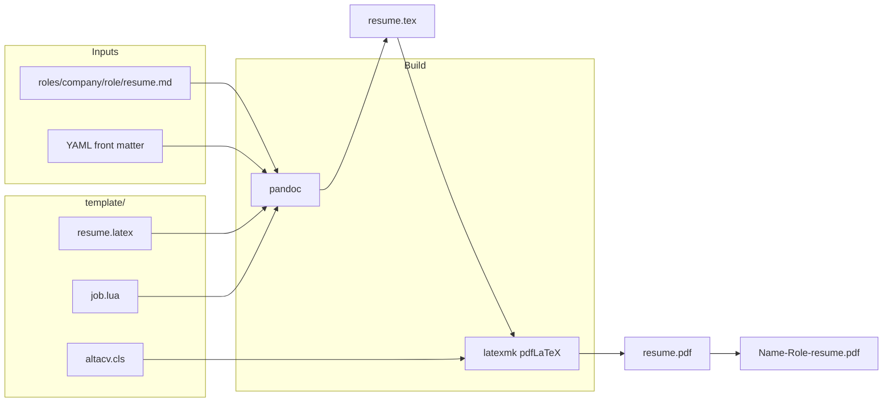
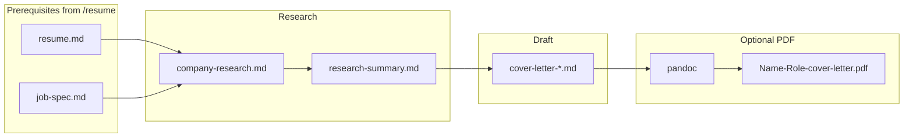

# Resume pipeline — design

User-facing how-to: [README.md](README.md). Build mechanics: [BUILD.md](BUILD.md).

## Goals and non-goals

**Goals:**

- Single pipeline: markdown in `roles/<company-slug>/<role-slug>/` → AltaCV-styled single-column PDF.
- Cover-letter pipeline: research → checkpoint → markdown letters → optional pandoc PDF (same role folder).
- Visual continuity with the original 2023 AltaCV layout (IFBlue palette, single column, no skills sidebar).
- Per-role tailoring without forking LaTeX or class files.

**Non-goals:**

- Pixel-perfect match to archived PDF content (content evolves via `master.md`).
- Cover-letter skill scaffolding role folders (requires `/resume` first).
- XeLaTeX / Carlito default toolchain.
- tectonic + generic `article` templates.
- HTML or other non-PDF export formats in this pipeline.
- Modern AltaCV paracol upgrade.

## System context



### Cover-letter pipeline



## Directory responsibilities

| Path | Responsibility |
|------|----------------|
| `template/` | Immutable styling and build logic — shared across all roles |
| `roles/<company-slug>/<role-slug>/` | Role folder: `resume.md` (build input) plus optional context and cover-letter artefacts |
| `roles/README.md` | Naming, layout, and scale guidance for role folders |
| `master.md` | Canonical content library; not a build input |

## Build pipeline

1. **`template/build.sh <role-dir>`** validates `resume.md` exists.
2. **Pandoc** reads markdown + YAML, applies `job.lua`, emits `role-dir/resume.tex` using `template/resume.latex`.
3. **`TEXINPUTS`** includes `template/` so `\documentclass{altacv}` resolves.
4. **`latexmk -pdf`** compiles `resume.tex` → `resume.pdf` (may invoke biber once via the class).
5. **`template/output-name.sh`** reads YAML and copies to `{Name-Slug}-{Role-Label}-resume.pdf`. Role label: `output_role` → `tagline` → role directory slug. Company slug is excluded.

Pandoc flags (fixed):

```bash
pandoc resume.md \
  -o resume.tex \
  --template="$TEMPLATE_DIR/resume.latex" \
  --lua-filter="$TEMPLATE_DIR/job.lua" \
  --from markdown+yaml_metadata_block+raw_attribute \
  --standalone \
  --shift-heading-level-by=-1
```

PDF is produced by `latexmk -pdf`, not pandoc’s `--pdf-engine`.

## Styling layer

**Class:** AltaCV v1.1.5 (`altacv.cls`) — marginpar sidebar optional; this pipeline uses single-column geometry only.

**Template (`resume.latex`):**

- IFBlue colour palette (from the original 2023 AltaCV reference)
- pdfLaTeX + Lato
- Maps `\section` → `\cvsection`, `\subsection` → `\cvsubsection`
- YAML → `\makecvheader`

**Why not pandoc `--pdf-engine`:** default PDF engines use generic LaTeX templates. The two-step tex + latexmk path uses the AltaCV class directly.

## Transformation layer (`job.lua`)

Converts Experience job headers to AltaCV `\cvevent` blocks. See `.cursor/plans/altacv_style_workflow/00-CONTEXT.md` for the full grammar.

```markdown
**{organisation} — {title}** · *{dates} | {location}*
```

**`\cvevent` mapping:**

| Argument | Field |
|----------|--------|
| 1 | title (after first ` — `) |
| 2 | organisation (before first ` — `) |
| 3 | dates (before ` \| ` in italic; hyphens → `--`) |
| 4 | location (after ` \| `) |

**Education guard:** from the `## Education` header until the next level-2 header, job conversion is disabled.

**Auto `\divider`:** inserted before the second and subsequent `\cvevent` blocks.

**Sub-jobs:** paragraphs that are only `**Sub-section Name**` (no italic tail) become `\cvsubsection{...}`.

**Single-pass `Pandoc` filter:** the filter walks `doc.blocks` in document order. Separate `Header` and `Para` callbacks with module-level state do not work — pandoc runs all callbacks per node type, not in document order.

**Known non-converted lines:**

- Education degree lines (inverted field order)
- Industry mentor line (no ` | location` in emphasis)
- Profile and skills paragraphs
- Intro paragraphs after `\cvevent`

**Future:** optional `education.lua` for structured education entries.

## Markdown ↔ LaTeX mapping

| Markdown | LaTeX output |
|----------|--------------|
| `## Experience` | `\cvsection{Experience}` |
| Job header paragraph | `\cvevent{title}{org}{dates}{location}{}{}` |
| `**Sub-section**` only paragraph | `\cvsubsection{...}` |
| `- bullet` | `itemize` |
| Skills paragraph | body text + `\textbf` |

## Toolchain decisions

| Decision | Choice | Rationale |
|----------|--------|-----------|
| TeX distribution | BasicTeX | Small install; tlmgr for packages |
| Engine | pdfLaTeX | FontAwesome Type1 works; XeLaTeX OTF failed on Mac |
| Body font | Lato | AltaCV pdfLaTeX branch |
| Markdown tool | Pandoc | Existing use; Lua filters |
| Class | AltaCV 1.1.5 | User preference; validated on macOS + BasicTeX |

## Comparison to other outputs

| Pipeline | Input | Style | Status |
|----------|-------|-------|--------|
| `template/build.sh` | `roles/**/resume.md` | AltaCV single column | **Primary** |
| `template/cover-letter-build.sh` | `roles/**/cover-letter-*.md` | Lato via `cover-letter.latex` | **Cover letters** |

## Extension points

- **New role:** add `roles/<company-slug>/<role-slug>/resume.md` via `new-role.sh`.
- **Cover letter:** invoke `/cover-letter` after `/resume`; optional PDF via `cover-letter-build.sh` and `output-name.sh --cover-letter`.
- **Style change:** edit `template/resume.latex` and possibly `altacv.cls` — rebuild all roles.
- **New markdown pattern:** extend `template/job.lua` or add filters; update README authoring rules.
- **CI:** run `./template/build.sh roles/<company>/<role>` on PR (optional).

## Agent workflow

Coding agents should follow `.cursor/skills/resume/SKILL.md` to scaffold roles, capture job specs, interview the user, and tailor `resume.md` from `master.md`. Compilation is always `./template/build.sh roles/<company-slug>/<role-slug>`.

For cover letters, follow `.cursor/skills/cover-letter/SKILL.md` **after** a tailored `resume.md` exists. Validation gate: missing `resume.md` or `job-spec.md` → stop and route to `/resume`.

## Open issues / future work

- `education.lua` for structured education entries
- Remove biber from the build path (fork class or empty bib)
- Photo support via YAML `photo:` + `\photo` in template
