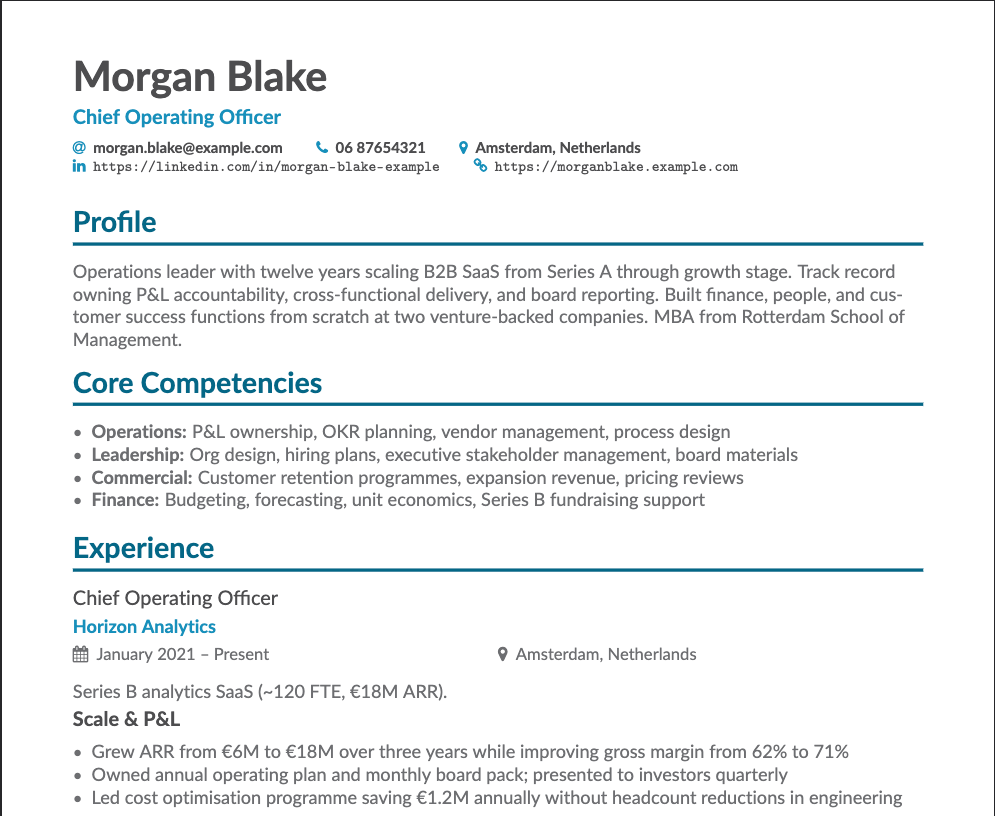

# Apply with agents

Tailor a resume and cover letter for each job application. You keep one experience library; the agent researches the role, drafts markdown, and builds AltaCV PDFs on your machine.

Works with [Cursor](https://cursor.com), [Claude Code](https://docs.anthropic.com/en/docs/claude-code), or any tool that reads [Agent Skills](https://agentskills.io).



Fictional examples with PDFs: [`examples/e2e/`](examples/e2e/).

## Contents

- [The problem](#the-problem)
- [Why not just ChatGPT?](#why-not-just-chatgpt)
- [Who this is for](#who-this-is-for)
- [Skills](#skills)
- [Get started](#get-started)
- [How it works](#how-it-works)
- [Documentation](#documentation)

## The problem

If you've used ChatGPT for applications, you probably know the drill. New chat, paste the CV again, ask for a cover letter, copy the output into Word, fight the formatting. The dates in chat three don't quite match chat one. The cover letter could go to any company.

By application five you're doing archaeology on old conversations. You still don't have a PDF you'd happily attach.

## Why not just ChatGPT?

ChatGPT is fine for a one-off. This repo is for people sending several applications who want the same steps (and the same PDF layout) each time.

| | ChatGPT | Apply with agents |
|---|---------|-------------------|
| **Output** | Text you paste into a template | AltaCV PDFs from a fixed local build |
| **Your experience** | Re-paste or re-upload each session | One `master.md` file; each role trims from it |
| **Facts and claims** | Same model drafts and edits | Claims tied to `master.md`; cover-letter auditors check against your files |
| **Cover letters** | Generic hooks; stock openers | Company research with sources, you sign off the hook, scripts catch banned phrases |
| **Later applications** | Earlier chats aren't in the loop | Same skills and folder layout every time |
| **Setup** | None | Clone once, run **`/setup`** (the agent walks you through PDF tools) |

Quick draft, you'll format and fact-check it yourself? ChatGPT.

Multiple roles, PDFs you can attach, and an experience library that stays put? This repo.

## Who this is for

Job seekers who are tired of reinventing the prompt every time. People already in Cursor or Claude Code who want `/setup`, `/resume`, and `/cover-letter` as actual workflows rather than vibes. You don't need to know git or LaTeX; the agent runs the boring parts.

It's a local repo: one folder per application, one master file for your career facts. If you want a browser-based resume builder, this isn't that.

## Skills

Type these in agent chat. Definitions live in [`.agents/skills/`](.agents/skills/) ([AGENTS.md](AGENTS.md), [CLAUDE.md](CLAUDE.md) for Claude Code).

| Skill | When to use |
|-------|-------------|
| **`/setup`** | First run — checks PDF tools, builds **`master.md`** and **`config/profile.yaml`** |
| **`/resume`** | New job (paste URL or description) or refresh an existing tailored resume |
| **`/cover-letter`** | After **`/resume`** for the same role — research, letter variants, optional PDF |
| **`/master`** | Add a role, fix dates, or fill in metrics in your experience library |

Each run produces AltaCV-styled PDFs (`{Name}-{Role}-resume.pdf`) and optional cover letter PDFs. Applications live under `roles/<company>/<role>/`.

## Get started

Full walkthrough: **[SETUP.md](SETUP.md)**.

1. **Clone and open the repo** in Cursor or Claude Code:

   ```bash
   git clone https://github.com/daniel-salter-ds/apply-with-agents.git
   cd apply-with-agents
   ```

2. **Run setup in chat:** type **`/setup`**. The agent checks whether your machine can build PDFs, helps install anything missing, then asks for existing resumes, a short search brief, and a short interview. It writes **`master.md`** and **`config/profile.yaml`**.

3. **Tailor a resume:** paste a job link, type **`/resume`**. The agent reads the posting, asks a few tailoring questions, drafts your resume, and builds a PDF.

4. **Cover letter (optional):** type **`/cover-letter`** for the same application. Review the research summary, pick a voice, get letter variants and an optional PDF.

## How it works

Your career facts live in **`master.md`**. Each application gets a folder under **`roles/<company>/<role>/`** with the job spec, tailored resume, research notes, and cover letters. That folder is gitignored; the workflow isn't.

Markdown goes through **`scripts/`** and **`render/`** (pandoc + AltaCV) to become PDF. Page count, word limits, banned phrases, and locale sit in **`config/`**. Before a cover letter PDF ships, scripts check word count and phrasing; auditor subagents re-read claims against your files.

Fictional worked examples: [`software-engineer`](examples/e2e/software-engineer/), [`operations-leader`](examples/e2e/operations-leader/).

<details>
<summary><strong>Repository layout</strong></summary>

```text
config/                 # shared defaults; profile.yaml is yours (gitignored)
master.template.md      # skeleton; /setup writes master.md (gitignored)
examples/e2e/           # synthetic resume + cover letter examples (with PDFs)
roles/_template/        # scaffold for new applications
scripts/                # build, setup, checks
render/                 # AltaCV LaTeX + pandoc templates
.agents/skills/         # /setup, /master, /resume, /cover-letter
.agents/agents/         # cover-letter auditor subagents
```

Personal files (`master.md`, `config/profile.yaml`, `config/target-role-research.md`, `inputs/`, and `roles/*/` except `_template`) are gitignored.

</details>

<details>
<summary><strong>Advanced: command line</strong></summary>

The same pipeline from a terminal:

```bash
./scripts/setup.sh                                    # once per machine
./scripts/new-role.sh acme staff-backend --url "…"   # scaffold application folder
./scripts/build.sh roles/acme/staff-backend           # resume PDF
./scripts/cover-letter-build.sh roles/acme/staff-backend professional
./scripts/check-cover-letter.sh roles/acme/staff-backend
```

Details: [BUILD.md](BUILD.md), [DESIGN.md](DESIGN.md).

</details>

## Documentation

| Doc | Contents |
|-----|----------|
| [SETUP.md](SETUP.md) | Plain-language onboarding |
| [BUILD.md](BUILD.md) | Build pipeline and PDF naming |
| [DESIGN.md](DESIGN.md) | Architecture and markdown rules |
| [roles/README.md](roles/README.md) | Application folder naming |

## Troubleshooting

| Problem | What to do |
|---------|------------|
| Agent says run **`/setup`** | `master.md` or `config/profile.yaml` missing |
| Agent asks about PDF tools | Stay in chat — **`/setup`** will guide you through installing what is missing ([SETUP.md](SETUP.md)) |
| Cover letter check fails | Ask the agent to fix the draft, or `./scripts/check-cover-letter.sh roles/…` |
| Symlinks missing after clone (Windows) | [SETUP.md §1](SETUP.md#1-clone-and-open-in-your-agent) |

## Requirements

- **OS:** macOS with Homebrew is the tested path. Linux works with adapted paths.
- **Tools:** pandoc and TeX Live — installed during **`/setup`** if missing (see [SETUP.md](SETUP.md) if you prefer manual install)
- **Agent:** Cursor, Claude Code, or compatible Agent Skills host
